# Coin Detection and Image Stitching

## Overview
This project consists of two main parts:

1. **Coin Detection, Segmentation, and Counting** using Hough Circle Transform.
2. **Image Stitching** to create a panorama from overlapping images.

---

## Part 1: Coin Detection, Segmentation, and Counting
This section detects, segments, and counts coins in an image using the Hough Circle Transform.

### Steps Involved
#### **Edge Detection & Circle Detection**
- Converts the image to grayscale.
- Applies Gaussian Blur to reduce noise.
- Uses the **Hough Circle Transform** to detect circular objects (coins).
- Draws detected circles on the original image.

#### **Segmentation & Counting**
- Crops individual detected coins from the image.
- Saves each segmented coin as a separate image.
- Displays the total number of detected coins in the terminal.

### Requirements
Install the necessary dependencies using:
```bash
pip install opencv-python numpy pandas matplotlib
```

### How to Run
1. Place your input image (`coins2.png`) in the same directory.
2. Run the script:
```bash
python coin_detection.py
```

### Methods Used
- **Hough Circle Transform**: Detects circular shapes in an image.
- **Gaussian Blur**: Smooths the image to remove noise.
- **Image Cropping**: Extracts individual coin regions.

### Example Outputs
#### **Input Coins Image:**
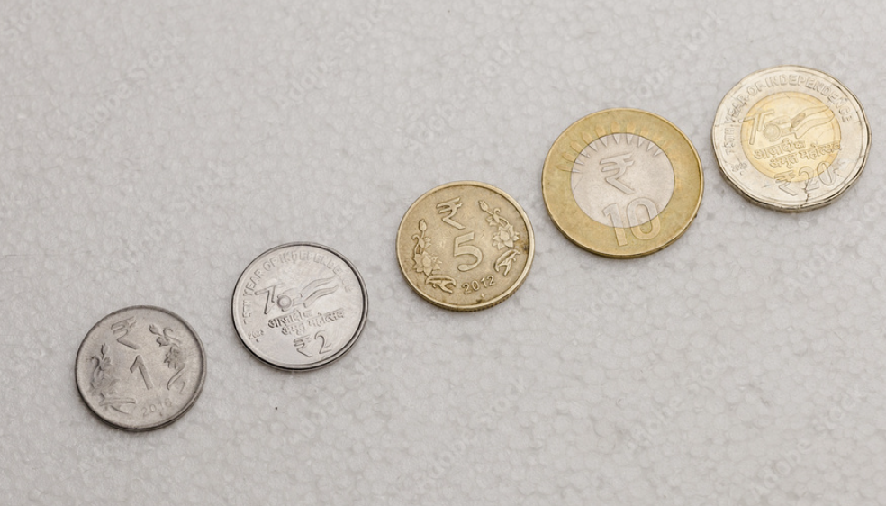

#### **Detected Coins Image:**
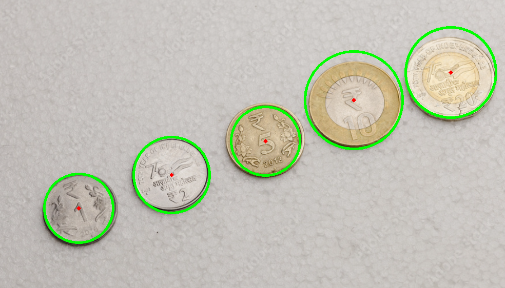

#### **Segmented Coins:**
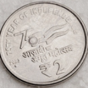
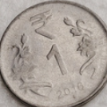
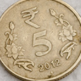
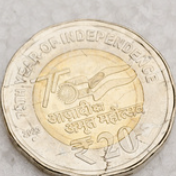
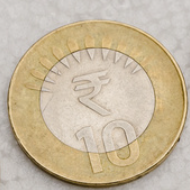
---

## Part 2: Image Stitching
This section stitches two overlapping images into a single panorama.

### Steps Involved
#### **Feature Detection & Matching**
- Reads input images and converts them to grayscale.
- Uses **SIFT (Scale-Invariant Feature Transform)** to extract keypoints.
- Matches keypoints using **FLANN-based matcher**.
- Filters and sorts matches using Lowe’s ratio test.

#### **Homography & Warping**
- Computes the **homography matrix** using RANSAC.
- Warps one image onto another to align them.
- Overlays images to create a seamless panorama.

### Requirements
Install dependencies using:
```bash
pip install opencv-python numpy matplotlib
```

### How to Run
1. Place your overlapping images (`p.jpeg` and `q.jpeg`) in the same directory.
2. Run the script:
```bash
python image_stitching.py
```

### Methods Used
- **SIFT**: Extracts keypoints and descriptors.
- **FLANN Matcher**: Matches feature points between images.
- **Homography**: Aligns images based on matched keypoints.
- **Perspective Warping**: Warps one image onto another for stitching.

### Example Outputs
#### **Input images:**
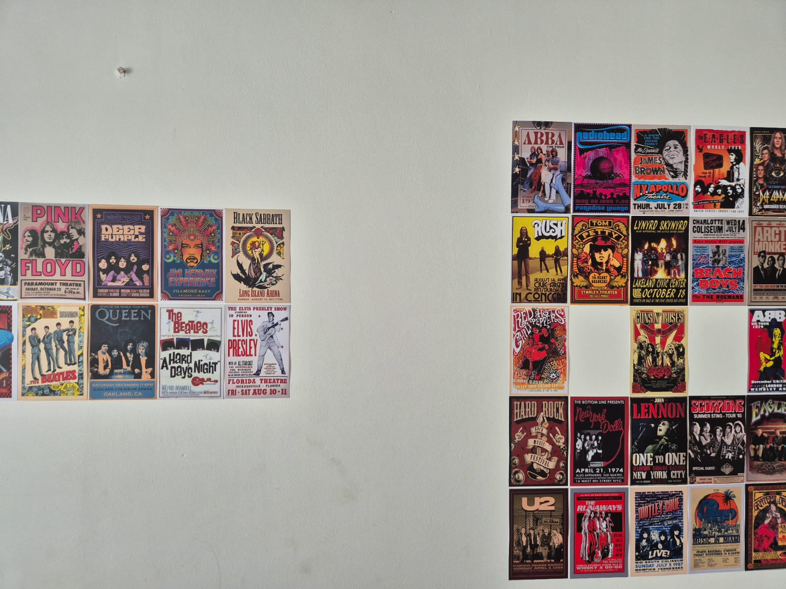
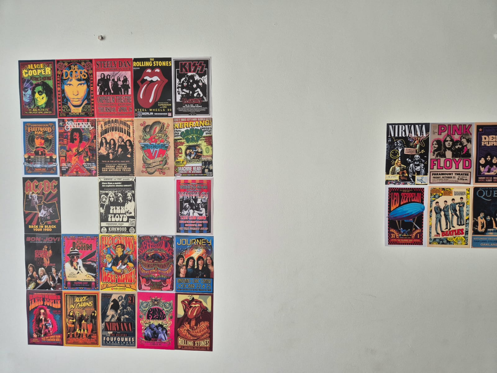

#### **Detected Keypoints:**

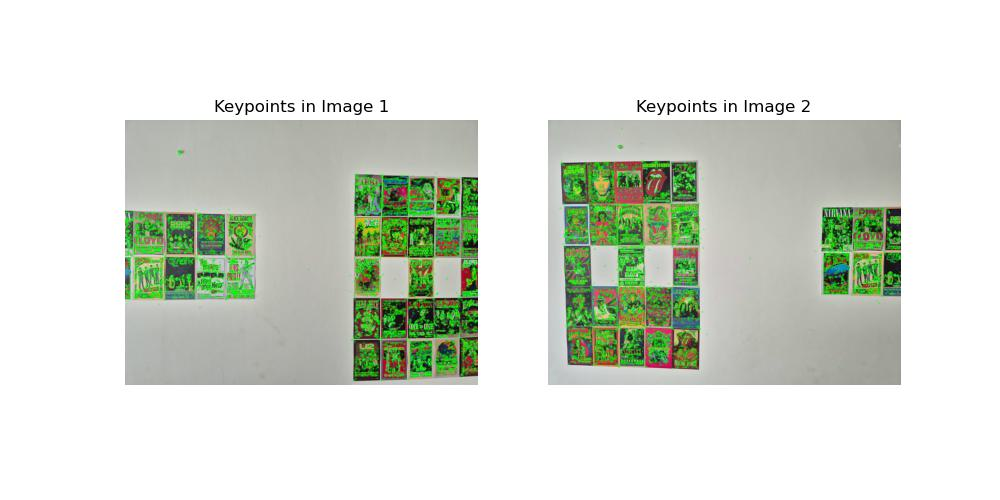

#### **Matched Keypoints:**
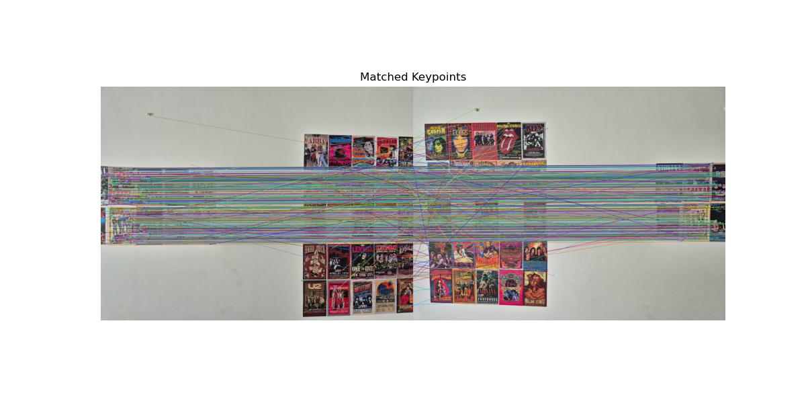

#### **Final Stitched Panorama:**
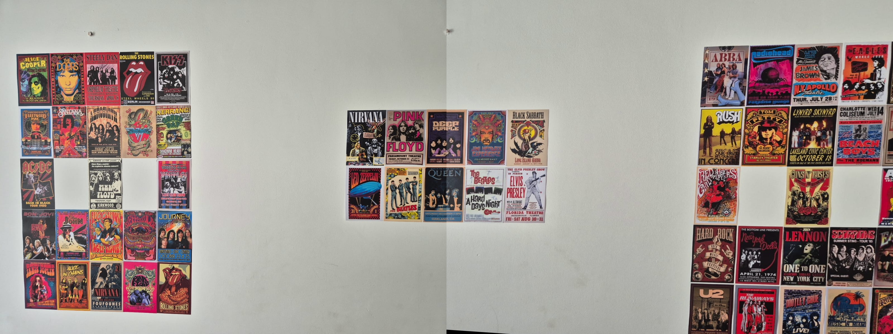

---

## Folder Structure
```
project_folder/
│── coin_detection.py  (Coin Detection & Segmentation)
│── image_stitching.py  (Panorama Stitching)
│── input_images/
│   ├── coins2.png
│   ├── p.jpeg
│   ├── q.jpeg
│── output_images/
│   ├── detected_coins.png
│   ├── coin_1.png
│   ├── keypoints1.jpg
│   ├── keypoints2.jpg
│   ├── matched_keypoints.jpg
│   ├── stitched_panorama.jpg
│── README.md
```

## Results & Observations
### **Coin Detection & Segmentation**
- Successfully detects coin edges using **Hough Circle Transform**.
- Effectively segments individual coins.
- Displays the number of detected coins in the terminal output.

### **Image Stitching**
- **SIFT keypoints** are accurately detected in both input images.
- Feature matching using **FLANN Matcher** successfully finds corresponding keypoints.
- The final panorama seamlessly combines two images using **homography and RANSAC**.

---


